# GitHub Actions CI/CD Architecture

## 1. Pipeline Overview

The project utilizes **GitHub Actions** to automate the build, test, and deployment lifecycle. The pipeline is designed to support a GitOps workflow with distinct environments for **Staging** and **Production**.

### Workflow Triggers

| Environment | Trigger | Workflow File |
| :--- | :--- | :--- |
| **Staging** | Push to `staging` branch | `.github/workflows/deploy-staging.yml` |
| **Production** | Push to `main` branch | `.github/workflows/deploy-production.yml` |

Both workflows can also be triggered manually via `workflow_dispatch`.

## 2. Architecture Diagram

```mermaid
graph LR
    Dev[Developer] -->|Push| GitHub[GitHub Repo]
    GitHub -->|Trigger| Actions[GitHub Actions Runner]
    
    subgraph "CI Pipeline"
        Actions -->|Checkout| Code[Source Code]
        Code -->|Test| PyTest[PyTest Suite]
        PyTest -->|Build| Docker[Docker Build]
        Docker -->|Push| ACR[Azure Container Registry]
    end
    
    subgraph "CD Pipeline"
        ACR -->|Pull| AKS[Azure Kubernetes Service]
        AKS -->|Apply| Manifests[K8s Deployment]
        Manifests -->|Rollout| Pods[Backend/Frontend Pods]
    end
```



## 3. Credential Management Strategy

The system employs a tiered security model to ensure zero trust and prevent credential leakage.

### Tier 1: Infrastructure Access (GitHub $\leftrightarrow$ Azure)
*   **Mechanism:** A dedicated Azure Service Principal (`github-actions-davinci-doc`) handles authentication.
*   **Storage:** Credentials are stored in the GitHub Repository Secret `AZURE_CREDENTIALS`.
*   **Permissions:**
    *   `Contributor` on Subscription (scoped to Resource Group `davinci_can_cen_rg1`).
    *   `AcrPush` on Container Registry `davinciai`.

### Tier 2: Application Secrets (Runtime)
*   **Mechanism:** Kubernetes Secrets injected as Environment Variables.
*   **Secret Name:** `davinci-doc-secrets` (Prod) / `davinci-doc-secrets-staging` (Staging).
*   **Key Contents:**
    *   `flask-secret-key`: Session encryption.
    *   `azure-client-secret`: Azure AD OAuth flow.
    *   `docusign-private-key`: RSA key for DocuSign JWT Auth.
*   **Injection:**
    *   **Env Vars:** Mapped via `valueFrom.secretKeyRef` in `deployment.yaml`.
    *   **Volumes:** DocuSign key is mounted as a file at `/app/secrets/docusign.key` (read-only).

## 4. Deployment Stages

### Stage 1: Continuous Integration (CI)
1.  **Unit Tests:** Runs `pytest tests/test_html_parser.py` to verify core logic.
2.  **Integration Tests:** Runs `pytest tests/test_pdf_generation.py` to verify PDF engine.
3.  **Container Build:**
    *   Builds `davinci-backend` and `davinci-frontend`.
    *   Tags images with the unique Git SHA (e.g., `prod-a1b2c3d`).
    *   Updates the `latest` tag for fallback.

### Stage 2: Continuous Deployment (CD)
1.  **Namespace Prep:** Ensures the target K8s namespace (`doc-generator` or `doc-generator-staging`) exists.
2.  **Manifest Application:** Applies `k8s/deployment.yaml` and `k8s/ingress.yaml`.
3.  **Image Update:** Specifically updates the Deployment to use the new SHA-tagged image, forcing a rolling restart.
4.  **Verification:** Waits for `kubectl rollout status` to confirm pod health.

## 5. Operational Guide

### Rolling Back a Deployment
If a defect escapes to production, use the previous image tag or the K8s undo command:

```bash
# Option 1: K8s Undo (Immediate revert to previous config)
kubectl rollout undo deployment/davinci-backend -n doc-generator

# Option 2: Deploy specific historical image
kubectl set image deployment/davinci-backend backend=davinciai.azurecr.io/davinci-backend:prod-<OLD_SHA> -n doc-generator
```

### Rotating Secrets
1.  Update the value in the local `k8s/secret.yaml` (do not commit this file!).
2.  Apply to the cluster:
    ```bash
    kubectl apply -f k8s/secret.yaml
    ```
3.  Restart pods to pick up new values:
    ```bash
    kubectl rollout restart deployment/davinci-backend -n doc-generator
    ```
